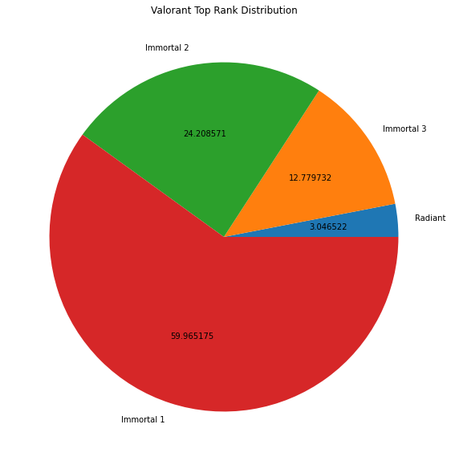
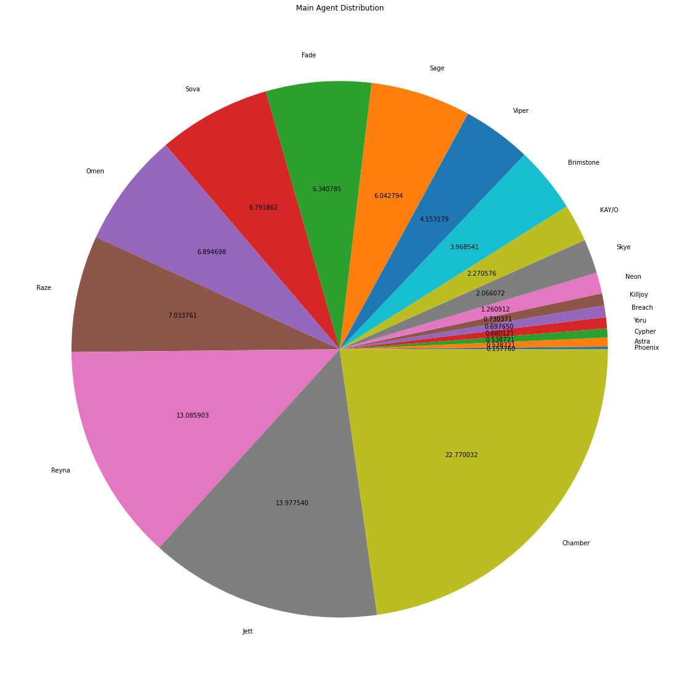
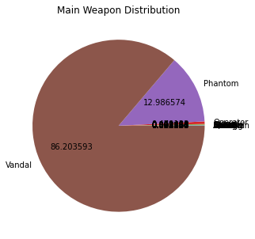

# Valorant Exploratory Data Analysis (EDA)

Note: Please use light mode for better read experience

## Introduction
Valorant is a first-person team-based game developed by a game developers company called “Riot Games”. The game was introduced on April 7, 2020, under the codename “Project A” and it was released on June 2, 2020. With a similar concept to CSGO (Counter Strike Global Offensive), this game comes with two teams with each team consisting of 5 players. The difference is, in Valorant, every agent or hero has a special skill to add to the excitement of the battle. Each agent has a different role which indicates how the agent is usually played

## Analysis Purpose
The analysis was carried out to analyze the agent’s data on Valorant, starting from the frequency chosen by the player, the percentage of wins, the effectiveness of the character in killing the opponent's character, and so on which concluded in the results in the form of a gameplay meta in Episode 4 Act 3 Valorant, especially about the gameplay balancing on every agent and weapons.

## The Benefit of the EDA
Through the results of data analysis, the game development team can decide what steps should be taken next to improve the meta gameplay and still maintain the balance of the gameplay by nerfing some overpowered agents and giving buffs to agents that are considered unplayable by most of the players.

## Dataset
In conducting the analysis, the dataset used is the Valorant leaderboard statistics dataset obtained from Kaggle with the site https://www.kaggle.com/datasets/aliibrahim10/valorant-stats which the dataset contains data on the performance of Valorant players in various regions in Valorant episode 4 act 3.

## Methodology
The Exploratory Data Analytics (EDA) was carried out using the python programming language and using various libraries, such as pandas, matplotlib, and pyspark. Pyspark is the library in charge of processing the data which is then converted into pandas format so that it can be visualized easily. The results of the data that have been converted into pandas will be visualized through the functions contained in the matplotlib library. The whole process is carried out with the help of Google Colab as a place to run the program.

## Result
<h3 align="center">
Player Rank Distributions
</h3>

  

  

The data we use are players from Immortal rank 3 to Radiant. We used that rating because the number of players who had a rating other than that seemed ridiculous. That's ridiculous in the sense that the number of players with iron to diamond ranks is not more than 100 which is not in accordance with the facts. Based on these data, the majority of valorant players have a rank of immortal 1, which means that these data are the data of professional valorant players.

  
 
 <h3 align="center">
Valorant Agent Distributions
</h3>

  

  

Based on these data, the majority of professional valorant players uses chamber because of his ability that gives the player additional weapons and being able to slow the enemies. On the other hands, professional valorant players rarelt uses phoenix because his ability doesn't gives the player that much benefits. 

<h3 align="center">
Valorant Weapon Distributions
</h3>

  

  

Based on these data, the majority of professional valorant players uses vandal as their weapon because this weapon has some affordable price and really good performance which able to kill an enemy in a single shot

## Conclusion
some Valorant agents need to be changed, such as phoenix by giving buffs to the character and changing agents that's too powerful such as Chamber. About the weapons, so far it can be said to be quite balanced with their respective characteristics. The gap of weapon pick rates is due to the fact that these two weapons (Vandal and Phantom) are the most popular types of weapons used in similar games, both Valorant and its predecessor, Counter Strike Global Offensive (CSGO).

